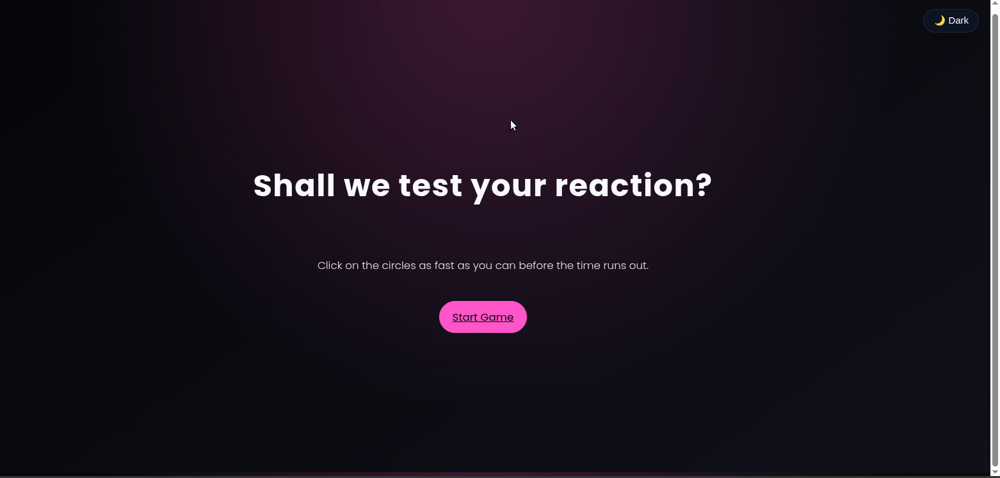
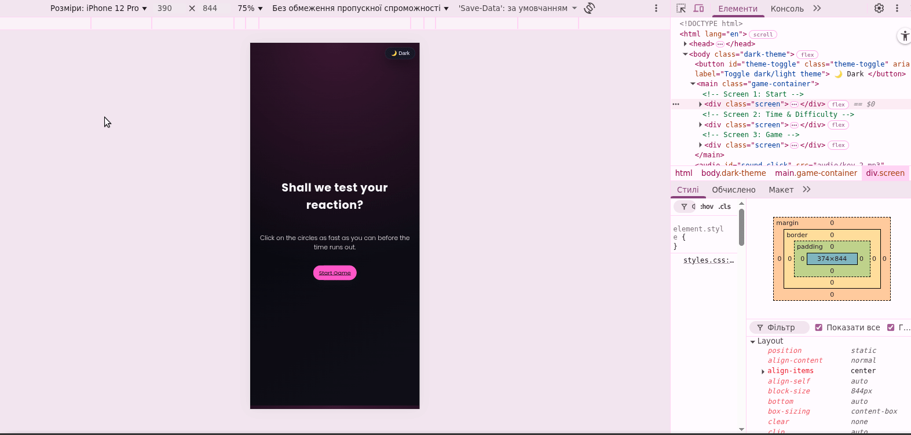

# Reaction Speed Game — JavaScript Timers

An interactive reaction game built with **vanilla JavaScript, HTML and CSS**.  
The goal is simple: click on the circles as fast as you can before the timer reaches zero — while sounds, haptics and difficulty levels make it more challenging and fun.

## Table of Contents
- [Project Goal](#project-goal)
- [How to play](#how-to-play)
- [Features](#features)
- [What I Learned (Technical Details)](#what-i-learned-technical-details)
- [Desktop and Mobile](#desktop-and-mobile)
- [Tech Stack](#tech-stack)
- [Demo](#demo)
- [Project Structure](#project-structure)

## Project Goal
This project was created to practice **JavaScript timers (`setInterval`)**, DOM manipulation, layout calculations with `getBoundingClientRect()`, event handling, theming (dark/light), responsive layout and small UX details like haptics and disabling unwanted selection on mobile.

This project is not just a simple reaction game — it’s also a showcase of my understanding of:
- JavaScript timers and game loops  
- DOM events and event delegation  
- responsive design and media queries  
- CSS variables and theme switching  
- layout calculations with `getBoundingClientRect()`  
- mobile UX tweaks (no selection, no tap highlight, haptics, sounds)  
It demonstrates how even a small game can combine many front-end concepts into a polished interactive experience.

## How to Play
1. Open the game in a browser (desktop or mobile).
2. On the first screen, click **“Start Game”**.
3. Choose the **game duration** (5, 20, 30 or 40 seconds).
4. Choose a **difficulty level**:
   - **Easy** – larger circles  
   - **Medium** – balanced  
   - **Hard** – smaller circles, harder to hit  
5. When the game starts, circles appear at random positions and sizes on the board.
6. **Click on each circle** to score a point. A new circle appears immediately.
7. If you **miss** (click on the board but not on a circle), you get different feedback (sound + stronger haptic where supported).
8. When time runs out, the game shows your final score and a button to play again.

## Features
- **Timer-based gameplay** using JavaScript timers.
- **Difficulty levels** (easy/medium/hard) that adjust circle sizes.
- **Dark / Light theme toggle** with CSS custom properties.
- **Sound effects**:
  - start game  
  - hit the circle  
  - end of the game  
  - miss (wrong place click)
- **Haptic feedback on mobile**:
  - light vibration on hit  
  - stronger vibration pattern on miss (where `navigator.vibrate` is supported)
- **Responsive design**:
  - mobile-friendly layout via media queries  
  - game board scales with viewport  
  - adaptive circle sizes on smaller screens
- **No text selection or copy popup** when long-pressing circles/board on mobile.


## What I Learned (Technical Details)

### 1. JavaScript Timers (`setInterval`)
I used `setInterval` to implement the countdown timer that updates every second:

```js
intervalId = setInterval(decreaseTime, 1000);
```
The game:
- starts the timer when the player chooses a duration and the game begins  
- decreases the time each second  
- stops the interval and ends the game when the time reaches zero

This project helped me understand **how timers drive gameplay**, how to stop them correctly with `clearInterval`, and how to keep the UI in sync with the timer.

### 2. DOM Manipulation & Event Handling
I worked a lot with the DOM:
- Selecting elements (`querySelector`, `querySelectorAll`) for screens, buttons and the board.
- Handling click events for:
  - starting the game  
  - choosing time and difficulty  
  - clicking on circles  
  - restarting the game  
  - toggling the theme  
- Dynamically creating and removing circles with `document.createElement`, setting inline styles, and inserting them into the board.
I also used **event delegation** on the board: a single click listener checks whether the click target is a circle or just empty board space. This makes the code simpler and avoids attaching listeners to every circle individually.

### 3. Game State & Logic
I manage game state with variables:
- `time` — remaining seconds  
- `score` — total hits  
- `currentDifficulty` — selected difficulty (easy/medium/hard)  
- `isGameActive` — flag that indicates whether the game is currently running  

The `isGameActive` flag is especially important:
- while the game is active → clicks on the board are treated as **hits** or **misses**  
- after the game ends → clicks on the result screen do **not** trigger sounds or haptics  

This shows I understand how to **separate UI rendering from game state** and avoid unexpected behavior.

### 4. Positioning with `getBoundingClientRect()`
To place circles correctly inside the board, I used:

```js
const { width, height } = board.getBoundingClientRect();
```
This gives the **actual rendered size** of the board in pixels. Then I generate random `x`/`y` coordinates within these bounds so that circles always appear fully inside the board (not cut off at the edges).
This helped me understand how `getBoundingClientRect()` is useful for **layout-aware calculations** and not just “magic random numbers”.

### 5. Randomness & Difficulty System
I defined a `difficultySettings` object that stores different min/max circle sizes for each level:

```js
const difficultySettings = {
  easy: { minSize: 35, maxSize: 80 },
  medium: { minSize: 25, maxSize: 65 },
  hard: { minSize: 15, maxSize: 55 }
};
```
Then, in `createRandomCircle()`, I use `Math.random()` and a helper `getRandomNumber(min, max)` to generate random sizes, positions and colors. Difficulty directly affects the minimum and maximum circle radius, making the game **visibly harder** on higher levels.

### 6. Dark / Light Theme with CSS Custom Properties
I implemented theming using **CSS variables** scoped to `body.dark-theme` and `body.light-theme`:

```css
body.dark-theme {
  --bg-color: #050509;
  --text-color: #f8f8ff;
  --accent: #ff6bcb;
}

body.light-theme {
  --bg-color: #f5f5ff;
  --text-color: #1a1a2b;
  --accent: #6b5bff;
}
```
The rest of the CSS uses `var(--bg-color)`, `var(--accent)`, etc., so switching the theme is just toggling body classes in JavaScript:
```js
document.body.classList.toggle('light-theme');
document.body.classList.toggle('dark-theme');
```
This shows I understand how to use **custom properties for theming** instead of duplicating styles.

### 7. Responsive Design & Mobile Adaptation
I added **media queries** to make the game look good on phones and tablets:
- Adjusting font sizes, button padding and board radius on smaller screens  
- Making the board square and based on viewport width on mobile  
- Tweaking spacing and theme toggle size for narrow screens  
On the JavaScript side, I also adapt circle sizes based on `window.innerWidth`, so circles are **larger on mobile devices**, which makes them easier to tap.

### 8. Sounds & Haptic Feedback
I used `<audio>` elements in HTML for all sound effects:
```html
<audio id="sound-click" src="audio/key-2.mp3" preload="auto"></audio>
<audio id="sound-start" src="./audio/key-19.mp3" preload="auto"></audio>
<audio id="sound-end" src="./audio/key-20.mp3" preload="auto"></audio>
<audio id="sound-wrong-place" src="./audio/key-8.mp3" preload="auto"></audio>
```
In JavaScript, I created a `playSound` helper and played:
- **click sound** when you hit a circle  
- **“wrong place” sound** when you miss  
- **start / end sounds** when the game starts and finishes  

For haptics I used the **Vibration API**:
- `navigator.vibrate(30)` for a light hit feedback  
- `navigator.vibrate([0, 40, 30, 40])` for a stronger “miss” pattern  
On Android this works as expected. On iOS Safari the `navigator.vibrate` API is not supported or is heavily restricted, so only the audio feedback works there.

### 9. Mobile UX Details: No Text Selection & Tap Highlight
On mobile, long-pressing elements can show selection handles or copy/share popups. I disabled this for the board and circles:
```css
.board,
.circle {
  -webkit-user-select: none;
  -ms-user-select: none;
  user-select: none;
  -webkit-touch-callout: none; /* disables iOS copy/share popup */
}

.board,
.circle,
.btn {
  -webkit-tap-highlight-color: transparent;
}
```
This prevents:
- text selection on long press  
- the iOS “copy / share” popup on circles  
- the grey tap highlight on buttons and the board  
It makes the app feel more like a native mobile game rather than a typical web page.

## Desktop & Mobile
- The layout is **responsive**: it works both on large desktop screens and on small phone screens.
- The game board scales with the viewport.
- Circles become larger on narrow screens to keep the game playable with touch.
- Sounds and game logic behave the same; only haptics may differ depending on platform support.

## Tech Stack
- **HTML5** — structure and audio elements  
- **CSS3** — layout, theming, media queries, custom properties  
- **Vanilla JavaScript (ES6+)** — timers, DOM manipulation, event handling, game logic  

## Demo
### Desktop


### Mobile (responsive)


## Project Structure
```
├── index.html           # Markup: 3 game screens, time & difficulty controls, audio tags
├── styles.css           # Layout, dark/light theme (CSS variables), responsive media queries
├── app.js               # Game logic: timers, difficulty, random circles, sounds, haptics, theme toggle
├── audio/               # Sound effects used in the game
│   ├── key-2.mp3        # Hit / circle click sound
│   ├── key-19.mp3       # Game start sound
│   ├── key-20.mp3       # Game end sound
│   └── key-8.mp3        # Miss / wrong place click sound
├── demo.gif             # Desktop gameplay preview
└── demo-mobile.gif      # Mobile gameplay preview
```
